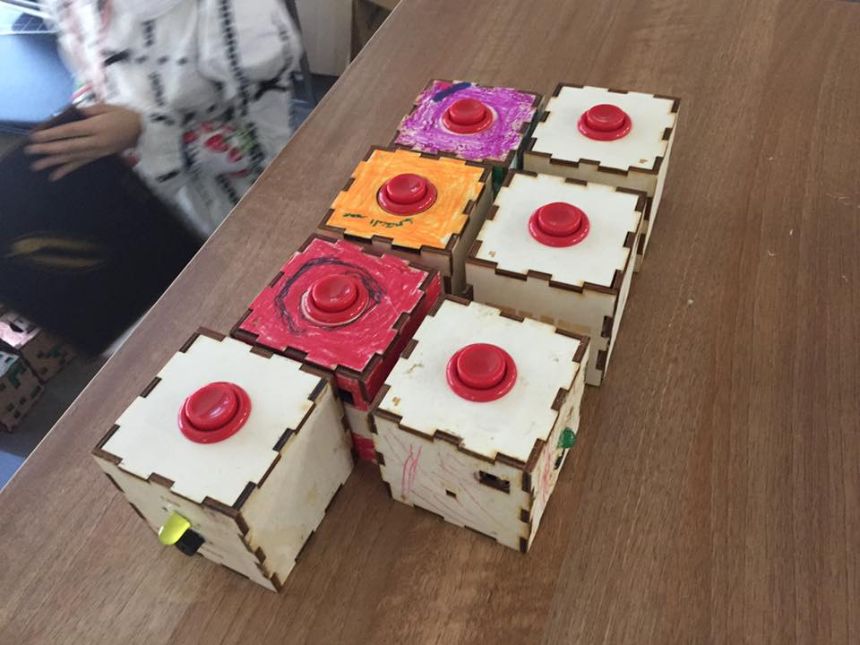
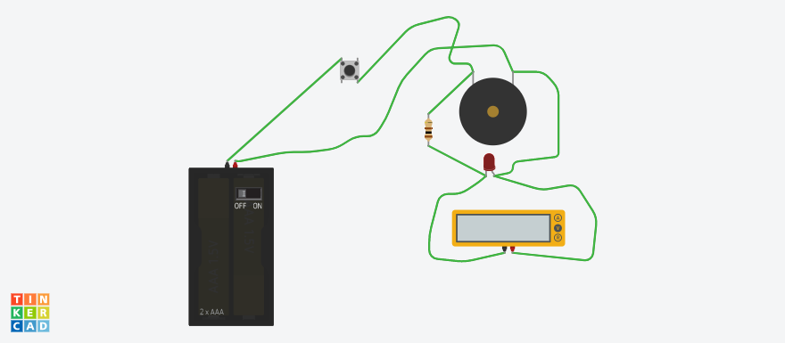

# TNT Button

This is ouer famous tnt button I developed for the wintercamp in Dubai. This version you can you can use as a stand alone button and buzzer but you can also hook it up to you raspberry pi or arduino to use as an inbut device.

There is one version you need would clue for and one pressfit version.

I the newest version I just skipped the LED so its just a Button, a 3V power supply and an active buzzer. 

You can 

## How you can help?

* lasercut the design yourself
* share your make with us
* make a workshop with it
* buy one and support erfindergarden
* help us to design a small pcb for it and some Attiny Circuit

## Designer

Andreas Kopp

openscad version Kaname Muroya

[kenny@erfindergarden.de](mailto:kenny@erfindergarden.de)

## Contact erfindergarden

Andreas Kopp

[andreas@erfindergarden.de](mailto:andreas@erfindergarden.de)

[www.erfindergarden.de](http://www.erfindergarden.de)

[www.facbebook.com/erfindergarden](http://www.facbebook.com/erfindergarden)

## Credits
 
Thanks Kenny for the parametric openscad version.

## License

This project is [Attribution-ShareAlike 2.5 Generic (CC BY-SA 2.5)](https://creativecommons.org/licenses/by-sa/2.5/). You can do anything what you want with it but please say that you got the original design from erfindergarden and als share it under the same license. 

For more information, see [license](license.md). 